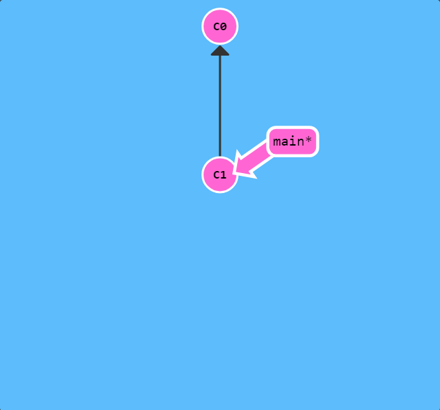

[Learn Git Branching](https://learngitbranching.js.org/?locale=zh_CN)

1. 你随时都可以用“objective”命令来打开这个对话框！

## Git Commit

Git 仓库中的提交记录保存的是你的目录下所有文件的快照，就像是把整个目录复制，然后再粘贴一样，但比复制粘贴优雅许多！

Git 希望提交记录尽可能地轻量，因此在你每次进行提交时，它并不会盲目地复制整个目录。条件允许的情况下，它会将当前版本与仓库中的上一个版本进行对比，并把所有的差异打包到一起作为一个提交记录。

Git 还保存了提交的历史记录。这也是为什么大多数提交记录的上面都有 parent 节点的原因 —— 我们会在图示中用箭头来表示这种关系。对于项目组的成员来说，维护提交历史对大家都有好处。

关于提交记录太深入的东西咱们就不再继续探讨了，现在你可以把提交记录看作是项目的快照。提交记录非常轻量，可以快速地在这些提交记录之间切换！

咱们来实际操作一下，看看提交记录是怎样的。右边展示了一个（小型）Git 代码库。当前有两个提交记录 —— 初始提交 `C0` 和其后可能包含某些有用修改的提交 `C1`。

点击下面的按钮创建一个新的提交记录。

`git commit`

好了！非常棒！我们刚才修改了代码库，并把这些修改保存成了一个提交记录 `C2`。`C2` 的 parent 节点是 `C1`， parent 节点是当前提交中变更的基础。

## Git Branch

Git 的分支也非常轻量。它们只是简单地指向某个提交纪录 —— 仅此而已。所以许多 Git 爱好者传颂：

> 早建分支！多用分支！

这是因为即使创建再多的分支也不会造成储存或内存上的开销，并且按逻辑分解工作到不同的分支要比维护那些特别臃肿的分支简单多了。

在将分支和提交记录结合起来后，我们会看到两者如何协作。现在只要记住使用分支其实就相当于在说：“我想基于这个提交以及它所有的 parent 提交进行新的工作。”

咱们通过实际操作来看看分支是什么样子的。

接下来，我们将要创建一个到名为 newImage 的分支。

`git branch newImage`

看到了吗，创建分支就是这么容易！新创建的分支 `newImage` 指向的是提交记录 `C1`。

现在咱们试着往新分支里提交一些东西。点击下面的按钮:

`git commit`

哎呀！为什么 `main` 分支前进了，但 `newImage` 分支还待在原地呢？！这是因为我们没有“在”这个新分支上，看到 `main` 分支上的那个星号（*）了吗？这表示当前所在的分支是 `main`。

现在咱们告诉 Git 我们想要切换到新的分支上：

`git checkout <name>`

下面的命令会让我们在提交修改之前先切换到新的分支上：

`git checkout newImage; git commit`

这就对了！我们的修改已经保存到新的分支里了。

注意：在 Git 2.23 版本中，引入了一个名为 `git switch` 的新命令，最终会取代 `git checkout`，因为 `checkout` 作为单个命令有点超载（它承载了很多独立的功能）。 由于现在很多人还无法使用 `switch`，本次课程仍然使用 `checkout` 而不是 `switch`， 但是如果你想尝试一下新命令，我们的应用也是支持的！并且你可以从[这里](https://git-scm.com/docs/git-switch)学到更多关于新命令的内容。

OK，你们都已经准备好使用分支了。当前窗口关闭后， 创建一个名为 bugFix 的新分支，然后切换过去。

对了，有个更简洁的方式：如果你想创建一个新的分支同时切换到新创建的分支的话，可以通过 `git checkout -b <your-branch-name>` 来实现。

## 分支与合并

太好了! 我们已经知道如何提交以及如何使用分支了。接下来咱们看看如何将两个分支合并到一起。就是说我们新建一个分支，在其上开发某个新功能，开发完成后再合并回主线。

咱们先来看一下第一种方法 —— `git merge`。在 Git 中合并两个分支时会产生一个特殊的提交记录，它有两个 parent 节点。翻译成自然语言相当于：“我要把这两个 parent 节点本身及它们所有的祖先都包含进来。”

通过图示更容易理解一些，咱们到下一页看一下。

我们准备了两个分支，每个分支上各有一个独有的提交。这意味着没有一个分支包含了我们修改的所有内容。咱们通过合并这两个分支来解决这个问题。

我们要把 `bugFix` 合并到 `main` 里：

`git merge bugFix`

哇哦！看见了吗？首先，`main` 现在指向了一个拥有两个 parent 节点的提交记录。假如从 `main` 开始沿着箭头向上看，在到达起点的路上会经过所有的提交记录。这意味着 `main` 包含了对代码库的所有修改。↓↓↓

还有，看见各个提交记录的颜色变化了吗？为了帮助学习理解，我引入了颜色搭配。每个分支都有不同的颜色，而每个提交记录的颜色是所有包含该提交记录的分支的颜色混合之后的颜色。

所以，`main` 分支的颜色被混入到所有的提交记录，但 `bugFix` 没有。下面咱们让它也改变一下颜色。

咱们再把 `main` 分支合并到 `bugFix`：

`git checkout bugFix; git merge main`

因为 `main` 继承自 `bugFix`，Git 什么都不用做，只是简单地把 `bugFix` 移动到 `main` 所指向的那个提交记录。

现在所有提交记录的颜色都一样了，这表明每一个分支都包含了代码库的所有修改！大功告成！
