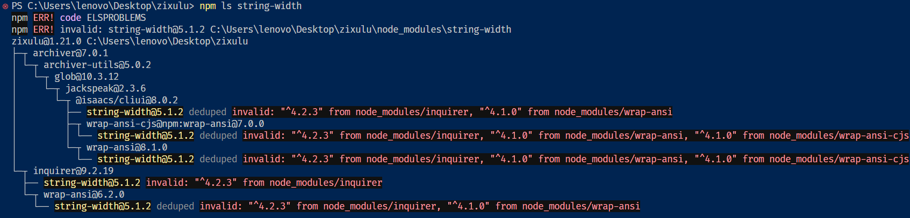

有时候，项目中可能会存在某个隐藏的依赖，又或者存在同一个依赖的多个版本，这时候我们可以通过以下命令来检查依赖来源：

```bash
# 推荐：npm
npm ls @types/react
# yarn
yarn why @types/react
```

当项目中存在多个版本的 `@types/react` 时，可能或报错：

> 不能用作 JSX 组件, 不是有效的 JSX 元素

这时我们可以在 `package.json` 中配置 `resolutions` 统一 `@types/react` 版本：

```javascripton
{
  "resolutions": {
    "@types/react": "^18.2.79"
  }
}
```

以下是实际遇到的案例，在启动某项目时，总是报以下错误：


去 github 一搜，发现是项目中存在多个版本 `string-width` 依赖（实际上只会安装最新的依赖）的问题，使用 `npm ls string-width` 查看：



将依赖项 `string-width` 版本改为 `^4`：

```javascripton
{
  "resolutions": {
    "string-width": "^4"
  }
}
```

再使用 `npm ls string-width` 查看：


问题解决了。

:::warning

1. 尽量使用多个版本中最低 major 版本的依赖，新版本可能是移除了某些特性
2. 解决这一个依赖的版本问题后，再次启动项目，可能还会报错，不要慌张，仔细看一下报错信息，有可能是另一个依赖的版本问题

:::
