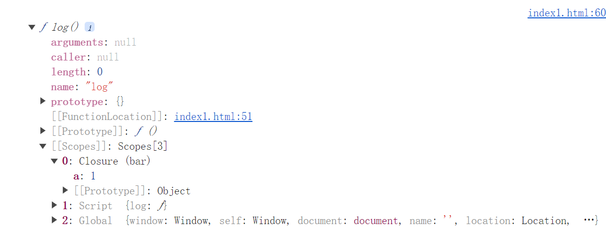
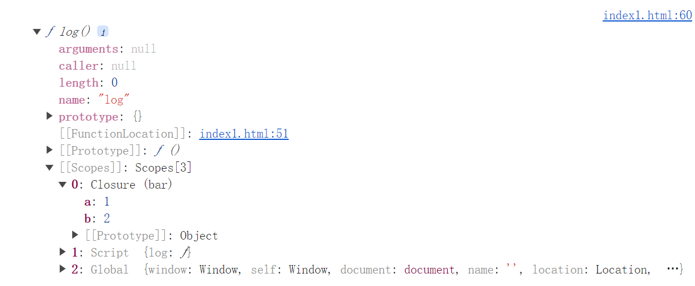

在 JavaScript 中，很多时候我们总是认为：一个变量如果无法被访问到了，那么它就会被垃圾回收，然而事实却并非如此：

```typescript
function bar() {
  const a = 1
  const b = 2
  function log() {
    console.log(a)
  }
  return log
}
const log = bar()
console.dir(log)
```

:::tip

使用 `console.dir` 可以避免控制台只打印变量的字符串形式

:::

可以看到，闭包如下：



但是如果我们再创建一个函数 `log2`，并且引用了变量 `b`：

```typescript
function bar() {
  const a = 1
  const b = 2
  function log() {
    console.log(a)
  }
  function log2() {
    console.log(b)
  }
  return log
}
const log = bar()
console.dir(log)
```

此时再查看闭包：



可以得出结论：**只要产生了闭包，而上下文中的其他变量又被其他函数所引用了，即使引用的函数无法被访问，被引用的变量也不会被回收**
