> [Learn Git Branching](https://learngitbranching.js.org/?locale=zh_CN)

## 基础篇

循序渐进地介绍 Git 主要命令

### Git Commit

Git 仓库中的提交记录保存的是你的目录下所有文件的快照，就像是把整个目录复制，然后再粘贴一样，但比复制粘贴优雅许多！

Git 希望提交记录尽可能地轻量，因此在你每次进行提交时，它并不会盲目地复制整个目录。条件允许的情况下，它会将当前版本与仓库中的上一个版本进行对比，并把所有的差异打包到一起作为一个提交记录。

Git 还保存了提交的历史记录。这也是为什么大多数提交记录的上面都有 parent 节点的原因 —— 我们会在图示中用箭头来表示这种关系。对于项目组的成员来说，维护提交历史对大家都有好处。

关于提交记录太深入的东西咱们就不再继续探讨了，现在你可以把提交记录看作是项目的快照。提交记录非常轻量，可以快速地在这些提交记录之间切换！

咱们来实际操作一下，看看提交记录是怎样的。右边展示了一个（小型）Git 代码库。当前有两个提交记录 —— 初始提交 `C0` 和其后可能包含某些有用修改的提交 `C1`。

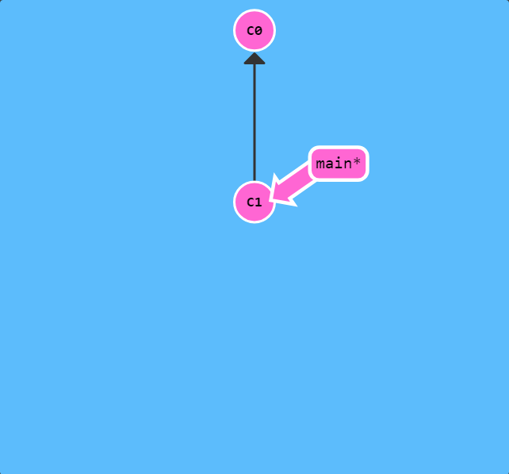

点击下面的按钮创建一个新的提交记录。

`git commit`

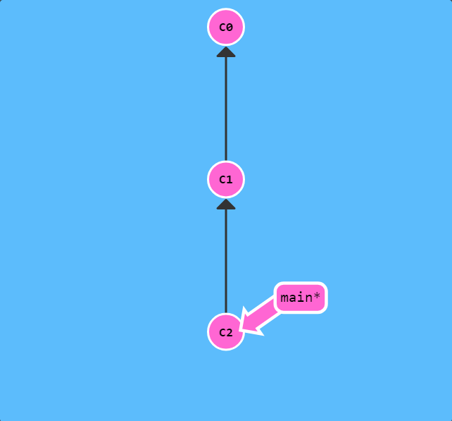

好了！非常棒！我们刚才修改了代码库，并把这些修改保存成了一个提交记录 `C2`。`C2` 的 parent 节点是 `C1`， parent 节点是当前提交中变更的基础。

### Git Branch

Git 的分支也非常轻量。它们只是简单地指向某个提交纪录 —— 仅此而已。所以许多 Git 爱好者传颂：

> 早建分支！多用分支！

这是因为即使创建再多的分支也不会造成储存或内存上的开销，并且按逻辑分解工作到不同的分支要比维护那些特别臃肿的分支简单多了。

在将分支和提交记录结合起来后，我们会看到两者如何协作。现在只要记住使用分支其实就相当于在说：“我想基于这个提交以及它所有的 parent 提交进行新的工作。”

咱们通过实际操作来看看分支是什么样子的。

接下来，我们将要创建一个到名为 newImage 的分支。

`git branch newImage`

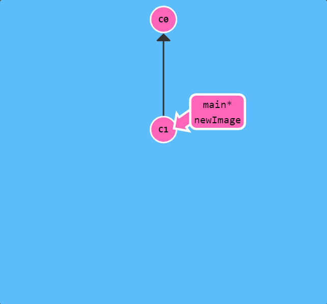

看到了吗，创建分支就是这么容易！新创建的分支 `newImage` 指向的是提交记录 `C1`。

现在咱们试着往新分支里提交一些东西。点击下面的按钮:

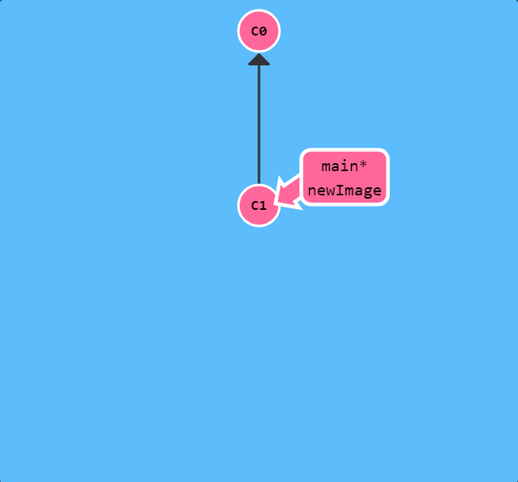

`git commit`

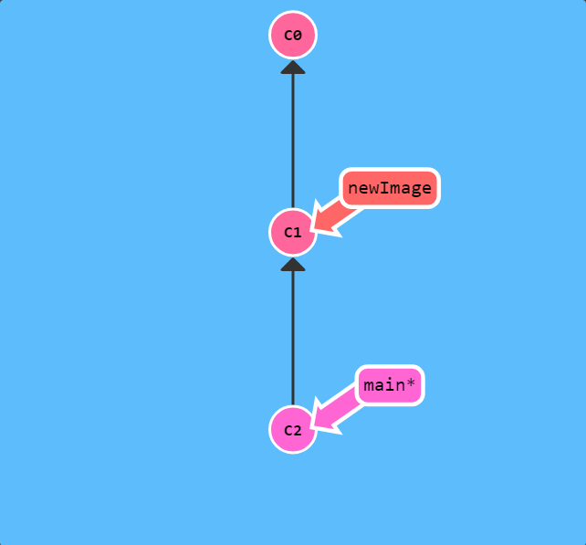

哎呀！为什么 `main` 分支前进了，但 `newImage` 分支还待在原地呢？！这是因为我们没有“在”这个新分支上，看到 `main` 分支上的那个星号（*）了吗？这表示当前所在的分支是 `main`。

现在咱们告诉 Git 我们想要切换到新的分支上：

`git checkout <name>`

下面的命令会让我们在提交修改之前先切换到新的分支上：

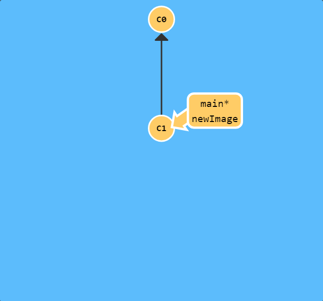

`git checkout newImage; git commit`

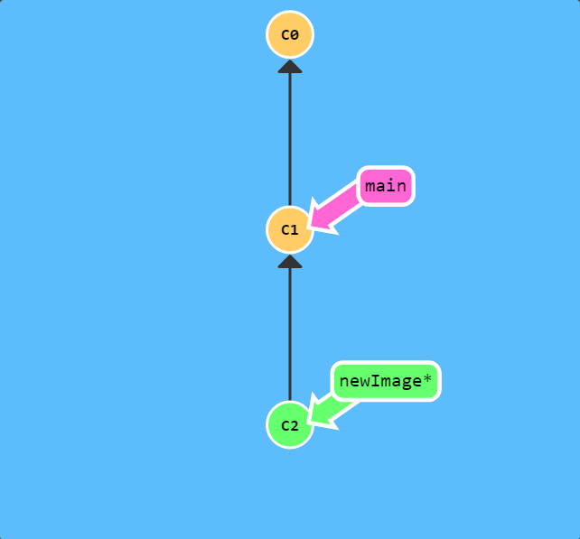

这就对了！我们的修改已经保存到新的分支里了。

注意：在 Git 2.23 版本中，引入了一个名为 `git switch` 的新命令，最终会取代 `git checkout`，因为 `checkout` 作为单个命令有点超载（它承载了很多独立的功能）。 由于现在很多人还无法使用 `switch`，本次课程仍然使用 `checkout` 而不是 `switch`， 但是如果你想尝试一下新命令，我们的应用也是支持的！并且你可以从[这里](https://git-scm.com/docs/git-switch)学到更多关于新命令的内容。

OK，你们都已经准备好使用分支了。当前窗口关闭后， 创建一个名为 bugFix 的新分支，然后切换过去。

对了，有个更简洁的方式：如果你想创建一个新的分支同时切换到新创建的分支的话，可以通过 `git checkout -b <your-branch-name>` 来实现。

### 分支与合并

太好了! 我们已经知道如何提交以及如何使用分支了。接下来咱们看看如何将两个分支合并到一起。就是说我们新建一个分支，在其上开发某个新功能，开发完成后再合并回主线。

咱们先来看一下第一种方法 —— `git merge`。在 Git 中合并两个分支时会产生一个特殊的提交记录，它有两个 parent 节点。翻译成自然语言相当于：“我要把这两个 parent 节点本身及它们所有的祖先都包含进来。”

通过图示更容易理解一些，咱们到下一页看一下。

我们准备了两个分支，每个分支上各有一个独有的提交。这意味着没有一个分支包含了我们修改的所有内容。咱们通过合并这两个分支来解决这个问题。

我们要把 `bugFix` 合并到 `main` 里：

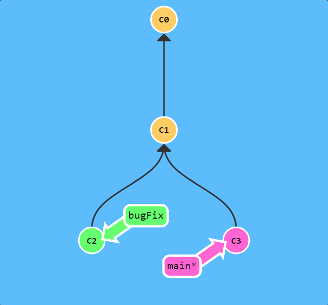

`git merge bugFix`

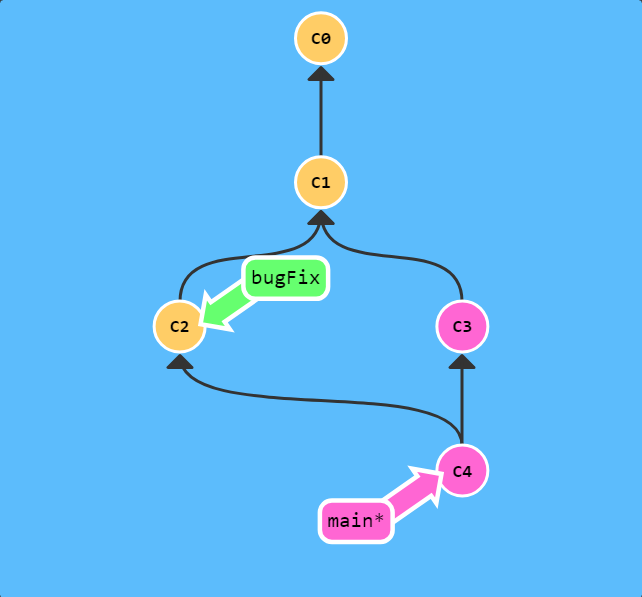

哇哦！看见了吗？首先，`main` 现在指向了一个拥有两个 parent 节点的提交记录。假如从 `main` 开始沿着箭头向上看，在到达起点的路上会经过所有的提交记录。这意味着 `main` 包含了对代码库的所有修改。↓↓↓

还有，看见各个提交记录的颜色变化了吗？为了帮助学习理解，我引入了颜色搭配。每个分支都有不同的颜色，而每个提交记录的颜色是所有包含该提交记录的分支的颜色混合之后的颜色。

所以，`main` 分支的颜色被混入到所有的提交记录，但 `bugFix` 没有。下面咱们让它也改变一下颜色。

咱们再把 `main` 分支合并到 `bugFix`：

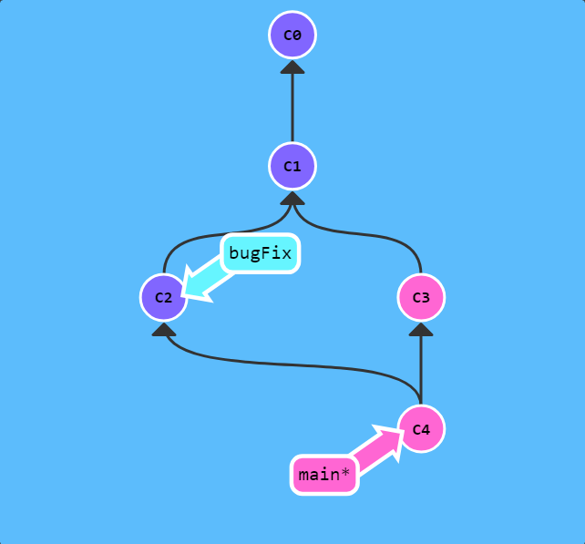

`git checkout bugFix; git merge main`

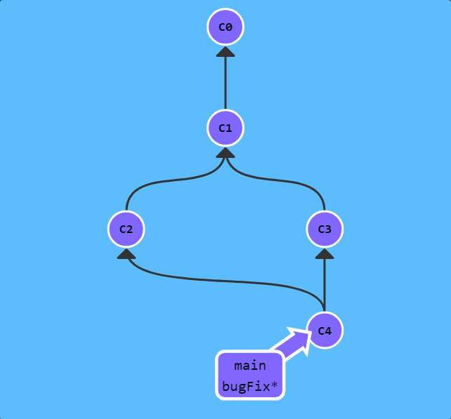

因为 `main` 继承自 `bugFix`，Git 什么都不用做，只是简单地把 `bugFix` 移动到 `main` 所指向的那个提交记录。

现在所有提交记录的颜色都一样了，这表明每一个分支都包含了代码库的所有修改！大功告成！

### Git Rebase

第二种合并分支的方法是 `git rebase`。Rebase 实际上就是取出一系列的提交记录，“复制”它们，然后在另外一个地方逐个的放下去。

Rebase 的优势就是可以创造更线性的提交历史，这听上去有些难以理解。如果只允许使用 Rebase 的话，代码库的提交历史将会变得异常清晰。

咱们还是实际操作一下吧……

还是准备了两个分支；注意当前所在的分支是 `bugFix`（星号标识的是当前分支）

我们想要把 `bugFix` 分支里的工作直接移到 main 分支上。移动以后会使得两个分支的功能看起来像是按顺序开发，但实际上它们是并行开发的。

咱们这次用 `git rebase` 实现此目标

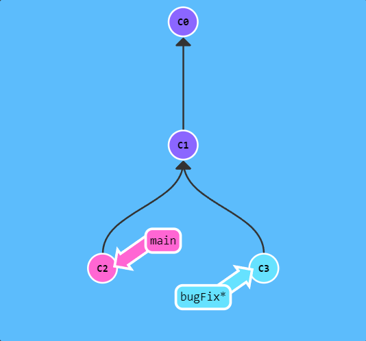

`git rebase main`

怎么样？！现在 `bugFix` 分支上的工作在 `main` 的最顶端，同时我们也得到了一个更线性的提交序列。

注意，提交记录 `C3` 依然存在（树上那个半透明的节点），而 `C3` 是我们 Rebase 到 `main` 分支上的 `C3` 的副本。

现在唯一的问题就是 `main` 还没有更新，下面咱们就来更新它吧……

现在我们切换到了 `main` 上。把它 rebase 到 `bugFix` 分支上……

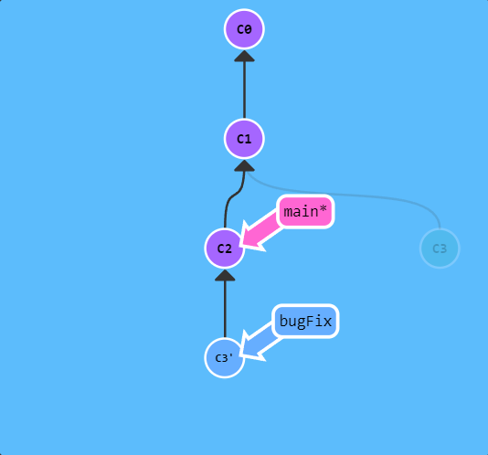

`git rebase bugFix`

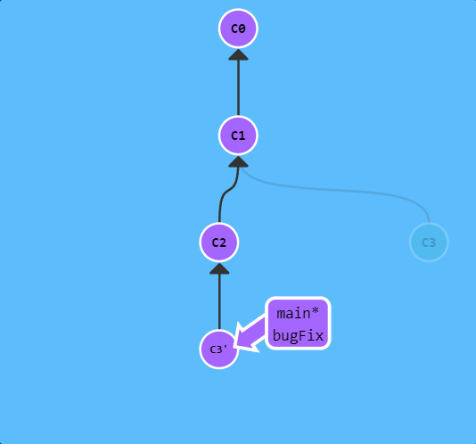

好了！由于 `bugFix` 继承自 `main`，所以 Git 只是简单的把 `main` 分支的引用向前移动了一下而已。

## 高级篇

### 在提交树上移动

在接触 Git 更高级功能之前，我们有必要先学习在你项目的提交树上前后移动的几种方法。

一旦熟悉了如何在 Git 提交树上移动，你驾驭其它命令的能力也将水涨船高！

### HEAD

我们首先看一下 “HEAD”。 `HEAD` 是一个对当前所在分支的符号引用 —— 也就是指向你正在其基础上进行工作的提交记录。

`HEAD` 总是指向当前分支上最近一次提交记录。大多数修改提交树的 Git 命令都是从改变 `HEAD` 的指向开始的。

`HEAD` 通常情况下是指向分支名的（如 `bugFix`）。在你提交时，改变了 `bugFix` 的状态，这一变化通过 `HEAD` 变得可见。

下面咱们通过实际操作看一下。我们将会观察提交前后 HEAD 的位置。

`git checkout C1; git checkout main; git commit; git checkout C2`

看到了吗？ `HEAD` 指向了 main，随着提交向前移动。

（译者注：实际这些命令并不是真的在查看 `HEAD` 指向，看下一屏就了解了。如果想看 `HEAD` 指向，可以通过 cat .git/HEAD 查看， 如果 `HEAD` 指向的是一个引用，还可以用 `git symbolic-ref HEAD` 查看它的指向。但是该程序不支持这两个命令）

#### 分离的 HEAD

分离的 HEAD 就是让其指向了某个具体的提交记录而不是分支名。在命令执行之前的状态如下所示：

`HEAD -> main -> C1`

`HEAD` 指向 `main`， `main` 指向 `C1`

`git checkout C1`

现在变成了

`HEAD -> C1`

### 相对引用

通过指定提交记录哈希值的方式在 Git 中移动不太方便。在实际应用时，并没有像本程序中这么漂亮的可视化提交树供你参考，所以你就不得不用 `git log` 来查查看提交记录的哈希值。

并且哈希值在真实的 Git 世界中也会更长（译者注：基于 SHA-1，共 40 位）。例如前一关的介绍中的提交记录的哈希值可能是 `fed2da64c0efc5293610bdd892f82a58e8cbc5d8`。舌头都快打结了吧...

比较令人欣慰的是，Git 对哈希的处理很智能。你只需要提供能够唯一标识提交记录的前几个字符即可。因此我可以仅输入 `fed2` 而不是上面的一长串字符。

正如我前面所说，通过哈希值指定提交记录很不方便，所以 Git 引入了相对引用。这个就很厉害了!

使用相对引用的话，你就可以从一个易于记忆的地方（比如 `bugFix` 分支或 `HEAD`）开始计算。

相对引用非常给力，这里我介绍两个简单的用法：

使用 `^` 向上移动 1 个提交记录
使用 `~<num>` 向上移动多个提交记录，如 `~3`

首先看看操作符 (^)。把这个符号加在引用名称的后面，表示让 Git 寻找指定提交记录的 parent 提交。

所以 `main^` 相当于“`main` 的 parent 节点”。

`main^^` 是 `main` 的第二个 parent 节点

现在咱们切换到 `main` 的 parent 节点

`git checkout main^`

搞定。这种方式是不是比输入哈希值方便多了？！

你也可以将 `HEAD` 作为相对引用的参照。下面咱们就用 `HEAD` 在提交树中向上移动几次。

`git checkout C3; git checkout HEAD^; git checkout HEAD^; git checkout HEAD^`

很简单吧？！我们可以一直使用 `HEAD^` 向上移动。

要完成此关，切换到 `bugFix` 的 parent 节点。这会进入分离 `HEAD` 状态。

如果你愿意的话，使用哈希值也可以过关，但请尽量使用相对引用！

### “~”操作符

如果你想在提交树中向上移动很多步的话，敲那么多 `^` 貌似也挺烦人的，Git 当然也考虑到了这一点，于是又引入了操作符 `~`。

该操作符后面可以跟一个数字（可选，不跟数字时与 `^` 相同，向上移动一次），指定向上移动多少次。咱们还是通过实际操作看一下吧

咱们用 `~<num>` 一次后退四步：

`git checkout HEAD~4`

多么的简洁 —— 相对引用就是方便啊！

### 强制修改分支位置

你现在是相对引用的专家了，现在用它来做点实际事情。

我使用相对引用最多的就是移动分支。可以直接使用 `-f` 选项让分支指向另一个提交。例如:

`git branch -f main HEAD~3`

上面的命令会将 `main` 分支强制指向 `HEAD` 的第 3 级 `parent` 提交。

现在咱们来演示一下刚才的命令：

`git branch -f main HEAD~3`

这就对了! 相对引用为我们提供了一种简洁的引用提交记录 `C1` 的方式， 而 `-f` 则容许我们将分支强制移动到那个位置。

既然你已经看过相对引用与强制移动分支的演示了，那么赶快使用这些技巧来挑战这一关吧！

要完成此关，移动 `HEAD`，`main` 和 `bugFix` 到目标所示的位置。

### 撤销变更

在 Git 里撤销变更的方法很多。和提交一样，撤销变更由底层部分（暂存区的独立文件或者片段）和上层部分（变更到底是通过哪种方式被撤销的）组成。我们这个应用主要关注的是后者。

主要有两种方法用来撤销变更 —— 一是 `git reset`，还有就是 `git revert`。接下来咱们逐个进行讲解。

#### Git Reset

`git reset` 通过把分支记录回退几个提交记录来实现撤销改动。你可以将这想象成“改写历史”。`git reset` 向上移动分支，原来指向的提交记录就跟从来没有提交过一样。

让我们来看看演示：

`git reset HEAD~1`

漂亮! Git 把 `main` 分支移回到 `C1`；现在我们的本地代码库根本就不知道有 `C2` 这个提交了。

（译者注：在reset后， `C2` 所做的变更还在，但是处于未加入暂存区状态。）

#### Git Revert

虽然在你的本地分支中使用 `git reset` 很方便，但是这种“改写历史”的方法对大家一起使用的远程分支是无效的哦！

为了撤销更改并分享给别人，我们需要使用 `git revert`。来看演示

`git revert HEAD`

奇怪！在我们要撤销的提交记录后面居然多了一个新提交！这是因为新提交记录 `C2'` 引入了更改 —— 这些更改刚好是用来撤销 `C2` 这个提交的。也就是说 `C2'` 的状态与 `C1` 是相同的。

`revert` 之后就可以把你的更改推送到远程仓库与别人分享啦。

## 移动提交记录

自由修改提交树

### 整理提交记录

到现在我们已经学习了 Git 的基础知识 —— 提交、分支以及在提交树上移动。 这些概念涵盖了 Git 90% 的功能，同样也足够满足开发者的日常需求

然而, 剩余的 10% 在处理复杂的工作流时(或者当你陷入困惑时）可能就显得尤为重要了。接下来要讨论的这个话题是“整理提交记录” —— 开发人员有时会说“我想要把这个提交放到这里, 那个提交放到刚才那个提交的后面”, 而接下来就讲的就是它的实现方式，非常清晰、灵活，还很生动。

看起来挺复杂, 其实是个很简单的概念

### Git Cherry-pick

本系列的第一个命令是 `git cherry-pick`, 命令形式为:

`git cherry-pick <提交号>...`

如果你想将一些提交复制到当前所在的位置（`HEAD`）下面的话， `Cherry-pick` 是最直接的方式了。我个人非常喜欢 `cherry-pick`，因为它特别简单。

咱们还是通过例子来看一下！

这里有一个仓库, 我们想将 `side` 分支上的工作复制到 `main` 分支，你立刻想到了之前学过的 `rebase` 了吧？但是咱们还是看看 `cherry-pick` 有什么本领吧。

`git cherry-pick C2 C4`

这就是了！我们只需要提交记录 `C2` 和 `C4`，所以 Git 就将被它们抓过来放到当前分支下了。 就是这么简单!

### 交互式的 rebase

当你知道你所需要的提交记录（并且还知道这些提交记录的哈希值）时, 用 `cherry-pick` 再好不过了 —— 没有比这更简单的方式了。

但是如果你不清楚你想要的提交记录的哈希值呢? 幸好 Git 帮你想到了这一点, 我们可以利用交互式的 `rebase` —— 如果你想从一系列的提交记录中找到想要的记录, 这就是最好的方法了

咱们具体来看一下……

交互式 `rebase` 指的是使用带参数 `--interactive` 的 `rebase` 命令, 简写为 -i

如果你在命令后增加了这个选项, Git 会打开一个 UI 界面并列出将要被复制到目标分支的备选提交记录，它还会显示每个提交记录的哈希值和提交说明，提交说明有助于你理解这个提交进行了哪些更改。

在实际使用时，所谓的 UI 窗口一般会在文本编辑器 —— 如 Vim —— 中打开一个文件。 考虑到课程的初衷，我弄了一个对话框来模拟这些操作。

当 rebase UI 界面打开时, 你能做3件事:

调整提交记录的顺序（通过鼠标拖放来完成）

删除你不想要的提交（通过切换 pick 的状态来完成，关闭就意味着你不想要这个提交记录）

合并提交。 遗憾的是由于某种逻辑的原因，我们的课程不支持此功能，因此我不会详细介绍这个操作。简而言之，它允许你把多个提交记录合并成一个。

接下来咱们看个实例

当你点击下面的按钮时，会出现一个交互对话框。对提交记录做个排序（当然你也可以删除某些提交），点击确定看结果

`git rebase -i HEAD~4`

## 杂项

Git 技术、技巧与贴士大集合

### 本地栈式提交

来看一个在开发中经常会遇到的情况：我正在解决某个特别棘手的 Bug，为了便于调试而在代码中添加了一些调试命令并向控制台打印了一些信息。

这些调试和打印语句都在它们各自的提交记录里。最后我终于找到了造成这个 Bug 的根本原因，解决掉以后觉得沾沾自喜！

最后就差把 `bugFix` 分支里的工作合并回 `main` 分支了。你可以选择通过 `fast-forward` 快速合并到 `main` 分支上，但这样的话 `main` 分支就会包含我这些调试语句了。你肯定不想这样，应该还有更好的方式……

实际我们只要让 Git 复制解决问题的那一个提交记录就可以了。跟之前我们在“整理提交记录”中学到的一样，我们可以使用

`git rebase -i`

`git cherry-pick`

来达到目的。

由于我们刚刚闯过类似的关卡，所以要不要再尝试一次就看你自己了。但是如果你想试一把的话，确保 `main` 分支能得到 `bugFix` 分支上的相关提交。

### 提交的技巧 #1

接下来这种情况也是很常见的：你之前在 `newImage` 分支上进行了一次提交，然后又基于它创建了 `caption` 分支，然后又提交了一次。

此时你想对某个以前的提交记录进行一些小小的调整。比如设计师想修改一下 `newImage` 中图片的分辨率，尽管那个提交记录并不是最新的了。

我们可以通过下面的方法来克服困难：

先用 `git rebase -i` 将提交重新排序，然后把我们想要修改的提交记录挪到最前

然后用 `git commit --amend` 来进行一些小修改

接着再用 `git rebase -i` 来将他们调回原来的顺序

最后我们把 `main` 移到修改的最前端（用你自己喜欢的方法），就大功告成啦！

当然完成这个任务的方法不止上面提到的一种（我知道你在看 `cherry-pick` 啦），之后我们会多点关注这些技巧啦，但现在暂时只专注上面这种方法。 最后有必要说明一下目标状态中的那几个`'` —— 我们把这个提交移动了两次，每移动一次会产生一个 `'`；而 `C2` 上多出来的那个是我们在使用了 `amend` 参数提交时产生的，所以最终结果就是这样了。

也就是说，我在对比结果的时候只会对比提交树的结构，对于 `'` 的数量上的不同，并不纳入对比范围内。只要你的 `main` 分支结构与目标结构相同，我就算你通过。

### 提交的技巧 #2

如果你还没有完成“提交的技巧 #1”（前一关）的话，请先通过以后再来！

正如你在上一关所见到的，我们可以使用 `rebase -i` 对提交记录进行重新排序。只要把我们想要的提交记录挪到最前端，我们就可以很轻松的用 `--amend` 修改它，然后把它们重新排成我们想要的顺序。

但这样做就唯一的问题就是要进行两次排序，而这有可能造成由 `rebase` 而导致的冲突。下面还是看看 `git cherry-pick` 是怎么做的吧。

要在心里牢记 `cherry-pick` 可以将提交树上任何地方的提交记录取过来追加到 `HEAD` 上（只要不是 `HEAD` 上游的提交就没问题）。

来看看这个例子：

`git cherry pick C2`

看到了吧？我们继续

这一关的目标和上一关一样，通过 `--amend` 改变提交记录 `C2`，但你不能用 `rebase -i`。自己想想要怎么解决吧！ :D

对了，提交记录上面的 `'` 的数量并不重要，只是引用的不同而已。也就是说如果你的最终结果在某个提交记录上多了个 `'`，我也会算你通过的。

### Git Tags

相信通过前面课程的学习你已经发现了：分支很容易被人为移动，并且当有新的提交时，它也会移动。分支很容易被改变，大部分分支还只是临时的，并且还一直在变。

你可能会问了：有没有什么可以永远指向某个提交记录的标识呢，比如软件发布新的大版本，或者是修正一些重要的 Bug 或是增加了某些新特性，有没有比分支更好的可以永远指向这些提交的方法呢？

当然有了！Git 的 tag 就是干这个用的啊，它们可以（在某种程度上 —— 因为标签可以被删除后重新在另外一个位置创建同名的标签）永久地将某个特定的提交命名为里程碑，然后就可以像分支一样引用了。

更难得的是，它们并不会随着新的提交而移动。你也不能切换到某个标签上面进行修改提交，它就像是提交树上的一个锚点，标识了某个特定的位置。

咱们来看看标签到底是什么样。

咱们先建立一个标签，指向提交记录 C1，表示这是我们 1.0 版本。

`git tag v1 C1`

很容易吧！我们将这个标签命名为 `v1`，并且明确地让它指向提交记录 `C1`，如果你不指定提交记录，Git 会用 `HEAD` 所指向的位置。

### Git Describe

由于标签在代码库中起着“锚点”的作用，Git 还为此专门设计了一个命令用来描述离你最近的锚点（也就是标签），它就是 `git describe`！

`Git Describe` 能帮你在提交历史中移动了多次以后找到方向；当你用 `git bisect`（一个查找产生 Bug 的提交记录的指令）找到某个提交记录时，或者是当你坐在你那刚刚度假回来的同事的电脑前时，可能会用到这个命令。

`git describe` 的​​语法是：

`git describe <ref>`

`<ref>` 可以是任何能被 Git 识别成提交记录的引用，如果你没有指定的话，Git 会使用你目前所在的位置（`HEAD`）。

它输出的结果是这样的：

`<tag>_<numCommits>_g<hash>`

`tag` 表示的是离 `ref` 最近的标签， `numCommits` 是表示这个 `ref` 与 `tag` 相差有多少个提交记录， `hash` 表示的是你所给定的 `ref` 所表示的提交记录哈希值的前几位。

当 `ref` 提交记录上有某个标签时，则只输出标签名称

让我们来看一个例子，对于下面的提交树：

`git tag v2 C3`

`git describe main` 会输出：

`v1_2_gC2`

`git describe side` 会输出：

`v2_1_gC4`

## 高级话题

只为真正的勇士！

### 多分支 rebase

哇，现在我们这里出现了很多分支呢！让我们把所有这些分支上所做的工作都通过 `rebase` 合并到 `main` 分支上吧。

但是你的领导给你提了点要求 —— 他们希望得到有序的提交历史，也就是我们最终的结果应该是 `C6'` 在 `C7'` 上面， `C5'` 在 `C6'` 上面，依此类推。

即使你搞砸了也没关系，用 `reset` 命令就可以重新开始了。记得看看我们提供的答案，看你能否使用更少的命令来完成任务！

### 选择 parent 提交记录

操作符 `^` 与 `~` 符一样，后面也可以跟一个数字。

但是该操作符后面的数字与 `~` 后面的不同，并不是用来指定向上返回几代，而是指定合并提交记录的某个 `parent` 提交。还记得前面提到过的一个合并提交有两个 `parent` 提交吧，所以遇到这样的节点时该选择哪条路径就不是很清晰了。

Git 默认选择合并提交的“第一个” `parent` 提交，在操作符 `^` 后跟一个数字可以改变这一默认行为。

废话不多说，举个例子。

这里有一个合并提交记录。如果不加数字修改符直接切换到 `main^`，会回到第一个 `parent` 提交记录。

(在我们的图示中，第一个 `parent` 提交记录是指合并提交记录正上方的那个提交记录。)

`git checkout main^`

这正是我们都已经习惯的方法。

现在来试试选择另一个 `parent` 提交……

看见了吧？我们回到了另外一个 `parent` 提交上。

使用 ^ 和 ~ 可以自由地在提交树中移动，非常给力：

`git checkout HEAD~; git checkout HEAD^2; git checkout HEAD~2`

快若闪电！

更厉害的是，这些操作符还支持链式操作！试一下这个：

`git checkout HEAD~^2~2`

和前面的结果一样，但只用了一条命令。

`git branch bugFix main~^2~`

在指定位置创建 `branch`

### 纠缠不清的分支

哇塞大神！这关我们要来点不同的！

现在我们的 `main` 分支是比 `one`、`two` 和 `three` 要多几个提交。出于某种原因，我们需要把 `main` 分支上最近的几次提交做不同的调整后，分别添加到各个的分支上。

`one` 需要重新排序并删除 `C5`，`two` 仅需要重排排序，而 `three` 只需要提交一次。

慢慢来，你会找到答案的 —— 记得通关之后用 `show solution` 看看我们的答案哦。

## 远程仓库

远程仓库并不复杂, 在如今的云计算盛行的世界很容易把远程仓库想象成一个富有魔力的东西, 但实际上它们只是你的仓库在另个一台计算机上的拷贝。你可以通过因特网与这台计算机通信 —— 也就是增加或是获取提交记录

话虽如此, 远程仓库却有一系列强大的特性

首先也是最重要的的点, 远程仓库是一个强大的备份。本地仓库也有恢复文件到指定版本的能力, 但所有的信息都是保存在本地的。有了远程仓库以后，即使丢失了本地所有数据, 你仍可以通过远程仓库拿回你丢失的数据。

还有就是, 远程让代码社交化了! 既然你的项目被托管到别的地方了, 你的朋友可以更容易地为你的项目做贡献(或者拉取最新的变更)

现在用网站来对远程仓库进行可视化操作变得越发流行了(像 GitHub), 但远程仓库永远是这些工具的顶梁柱, 因此理解其概念非常的重要!

### 创建远程仓库

直到现在, 教程都聚焦于本地仓库的操作（`branch`、`merge`、`rebase` 等等）。但我们现在需要学习远程仓库的操作 —— 我们需要一个配置这种环境的命令, 它就是 `git clone`。 从技术上来讲，`git clone` 命令在真实的环境下的作用是在本地创建一个远程仓库的拷贝（比如从 github.com）。 但在我们的教程中使用这个命令会有一些不同 —— 它会在远程创建一个你本地仓库的副本。显然这和真实命令的意思刚好相反，但是它帮咱们把本地仓库和远程仓库关联到了一起，在教程中就凑合着用吧。

咱们慢慢来，先看看远程仓库（在图示中）的样子。

`git clone`

就是它了! 现在我们有了一个自己项目的远程仓库。除了远程仓库使用虚线之外, 它们几乎没有什么差别 —— 在后面的关卡中, 你将会学习怎样在本地仓库和远程仓库间分享工作成果。

要完成本关, 用 `git clone` 复制下你的仓库就可以了。后续的课程我们会正式地学习

### 远程分支

既然你已经看过 `git clone` 命令了，咱们深入地看一下发生了什么。

你可能注意到的第一个事就是在我们的本地仓库多了一个名为 `o/main` 的分支, 这种类型的分支就叫远程分支。由于远程分支的特性导致其拥有一些特殊属性。

远程分支反映了远程仓库(在你上次和它通信时)的状态。这会有助于你理解本地的工作与公共工作的差别 —— 这是你与别人分享工作成果前至关重要的一步.

远程分支有一个特别的属性，在你切换到远程分支时，自动进入分离 `HEAD` 状态。Git 这么做是出于不能直接在这些分支上进行操作的原因, 你必须在别的地方完成你的工作, （更新了远程分支之后）再用远程分享你的工作成果。

### 为什么有 `o/`？

你可能想问这些远程分支的前面的 `o/` 是什么意思呢？好吧, 远程分支有一个命名规范 —— 它们的格式是:

`<remote name>/<branch name>`

因此，如果你看到一个名为 `o/main` 的分支，那么这个分支就叫 `main`，远程仓库的名称就是 `o`。

大多数的开发人员会将它们主要的远程仓库命名为 `origin`，并不是 `o`。这是因为当你用 `git clone` 某个仓库时，Git 已经帮你把远程仓库的名称设置为 `origin` 了

不过 `origin` 对于我们的 UI 来说太长了，因此不得不使用简写 `o` :) 但是要记住, 当你使用真正的 Git 时, 你的远程仓库默认为 `origin`!

说了这么多，让我们看看实例

如果切换到远程分支会怎么样呢？

`git checkout o/main; git commit`

正如你所见，Git 变成了分离 `HEAD` 状态，当添加新的提交时 `o/main` 也不会更新。这是因为 `o/main` 只有在远程仓库中相应的分支更新了以后才会更新。

### Git Fetch

Git 远程仓库相当的操作实际可以归纳为两点：向远程仓库传输数据以及从远程仓库获取数据。既然我们能与远程仓库同步，那么就可以分享任何能被 Git 管理的更新（因此可以分享代码、文件、想法、情书等等）。

本节课我们将学习如何从远程仓库获取数据 —— 命令如其名，它就是 `git fetch`。

你会看到当我们从远程仓库获取数据时, 远程分支也会更新以反映最新的远程仓库。在上一节课程中我们已经提及过这一点了。

在解释 `git fetch` 前，我们先看看实例。这里我们有一个远程仓库, 它有两个我们本地仓库中没有的提交。

#### git fetch 做了些什么

`git fetch` 完成了仅有的但是很重要的两步:

从远程仓库下载本地仓库中缺失的提交记录

- 更新远程分支指针(如 `o/main`)
- `git fetch` 实际上将本地仓库中的远程分支更新成了远程仓库相应分支最新的状态。

如果你还记得上一节课程中我们说过的，远程分支反映了远程仓库在你最后一次与它通信时的状态，`git fetch` 就是你与远程仓库通信的方式了！希望我说的够明白了，你已经了解 `git fetch` 与远程分支之间的关系了吧。

`git fetch` 通常通过互联网（使用 `http://` 或 `git://` 协议) 与远程仓库通信。

#### git fetch 不会做的事

`git fetch` 并不会改变你本地仓库的状态。它不会更新你的 `main` 分支，也不会修改你磁盘上的文件。

理解这一点很重要，因为许多开发人员误以为执行了 `git fetch` 以后，他们本地仓库就与远程仓库同步了。它可能已经将进行这一操作所需的所有数据都下载了下来，但是并没有修改你本地的文件。我们在后面的课程中将会讲解能完成该操作的命令 :D

所以, 你可以将 `git fetch` 的理解为单纯的下载操作。

### Git Pull

既然我们已经知道了如何用 `git fetch` 获取远程的数据, 现在我们学习如何将这些变化更新到我们的工作当中。

其实有很多方法的 —— 当远程分支中有新的提交时，你可以像合并本地分支那样来合并远程分支。也就是说就是你可以执行以下命令:

- `git cherry-pick o/main`
- `git rebase o/main`
- `git merge o/main`
- 等等

实际上，由于先抓取更新再合并到本地分支这个流程很常用，因此 Git 提供了一个专门的命令来完成这两个操作。它就是我们要讲的 `git pull`。

我们先来看看 `fetch`、`merge` 依次执行的效果

`git fetch; git merge o/main`

我们用 `fetch` 下载了 `C3`, 然后通过 `git merge o/main` 合并了这一提交记录。现在我们的 `main` 分支包含了远程仓库中的更新（在本例中远程仓库名为 `origin`）

如果使用 `git pull` 呢?

同样的结果！这清楚地说明了 `git pull` 就是 `git fetch` 和 `git merge` 的缩写！

稍后我们会探索一下 `git pull` 的细节(包括选项和参数)，现在咱们先解决这个关卡。

实际上你完全可以用 `fetch` 和 `merge` 通过本关，但是这会增加你的命令数。 :P
